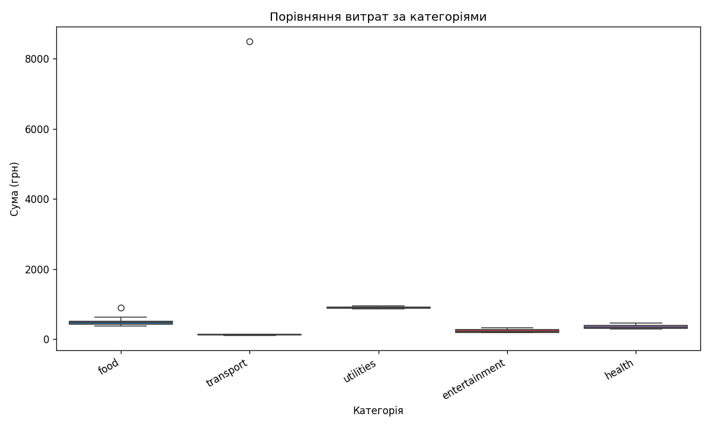
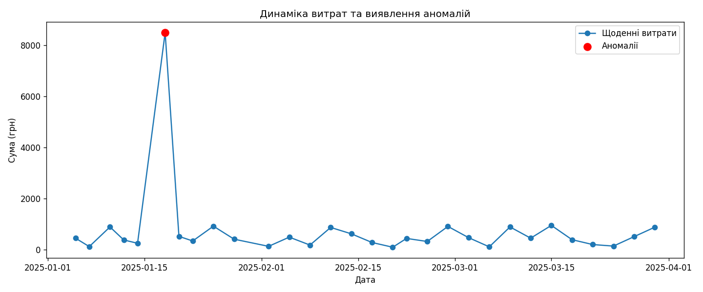
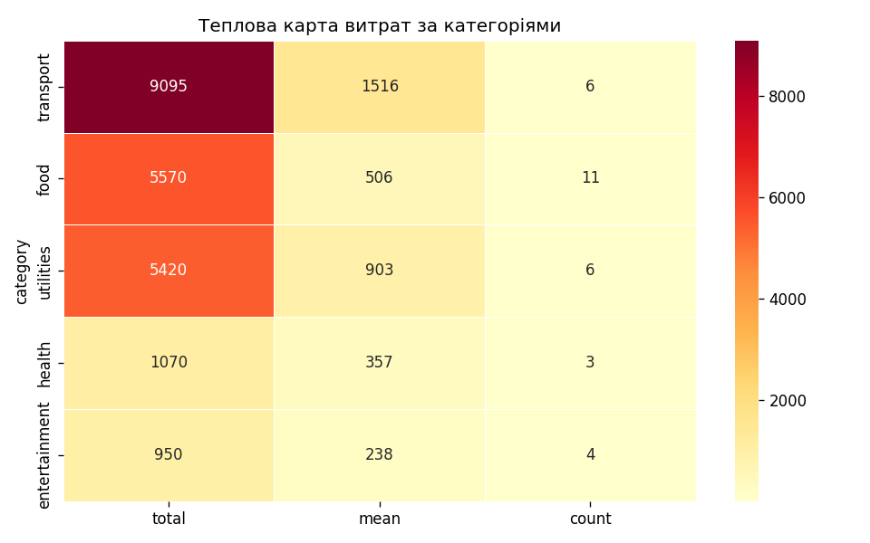

# Практична робота: Агент аналізу фінансових витрат (FinScope)

**Виконав:** Михайлець Артем, ТВ-33  
**Варіант 13**

---

## Опис завдання

Метою роботи є розробка програмного агента **FinScope**, який збирає та обробляє дані про особисті витрати, знаходить аномалії, будує прогноз за допомогою **лінійної регресії** і групує категорії витрат методом **кластеризації K-Means**.

Агент повинен мати властивості дослідника:

- **Пам'ять** — збереження результатів попередніх запусків;
- **Інструменти** — модулі аналізу та візуалізації;
- **Адаптація** — зміна параметрів під конкретний набір даних;
- **Планування** — формування послідовності кроків перед обчисленнями.

Вхідні дані — таблиця CSV (`date`, `category`, `amount`, `description`). Тестовий набір: `data/expenses_sample.csv` (30 операцій за січень–березень 2025).

---

## Логіка обробки даних

1. **Завантаження.** Читання CSV, перетворення дат, підрахунок загальної суми витрат.

2. **Планування.** Агент складає план: перевірка даних → підсумок по категоріях → пошук аномалій → регресія → кластеризація → побудова графіків. Якщо є попередня сесія в пам'яті — додається крок порівняння.

3. **Адаптація.** За коефіцієнтом варіації сум (CV) підбирається поріг Z-Score (від 2.5 до 3.5) і кількість кластерів K-Means.

4. **Аномалії.** Метод Z-Score: транзакції, де \|z\| перевищує поріг, вважаються нетиповими витратами.

5. **Регресія.** По сумарних витратах за місяцями будується лінійна модель; обчислюються коефіцієнт R², напрям тренду та прогноз на наступні 2–3 місяці.

6. **Кластеризація.** K-Means за ознаками `sum`, `mean`, `count` для кожної категорії — виділення груп з подібною структурою витрат.

7. **Пам'ять.** Результати сесії записуються у `output/memory.json`; при наступному запуску можливе порівняння з попередніми показниками.

---

## Програмна реалізація

| Модуль | Призначення |
|--------|-------------|
| `src/planner.py` | Планування кроків |
| `src/adaptive.py` | Адаптація параметрів |
| `src/tools.py` | Z-Score, регресія, K-Means |
| `src/memory.py` | Пам'ять агента |
| `src/agent.py` | Координація всіх етапів |
| `app.py` | Веб-інтерфейс (Streamlit) |
| `main.py` | Консольний запуск |

Запуск веб-версії:

```bash
pip install -r requirements.txt
streamlit run app.py
```

Консольний режим: `python main.py`.

---

## Робота веб-інтерфейсу

Після запуску `streamlit run app.py` у браузері відкривається панель керування агентом. Користувач обирає джерело даних (демо-файл або власний CSV) і запускає аналіз.


На головній сторінці відображаються підсумкові метрики, **план аналізу** (планування), параметри адаптації, результати регресії та кластеризації:


---

## Результати аналізу

На тестовому наборі зафіксовано **13 690 грн** загальних витрат. Найбільша частка — категорія `food` та комунальні платежі (`utilities`). Тренд місячних витрат за регресією — **зростання** (R² ≈ 0.71). K-Means виділив два кластери: «великі регулярні витрати» (їжа, комунальні) та «менші разові» (транспорт, розваги, здоров'я).

### 1. Порівняння витрат за категоріями

Boxplot показує розподіл сум по категоріях. Найвищий розкид значень — у категорії їжі.



### 2. Динаміка витрат та аномалії

На часовому ряді видно зміну щоденних витрат. Червоні маркери — транзакції, визнані аномальними за Z-Score.



### 3. Теплова карта витрат

Колір відображає суму, середнє значення та кількість операцій у кожній категорії.



---

## Лог виконання програми

Консольний запуск підтверджує той самий алгоритм без веб-оболонки:


```
============================================================
  FinScope — агент аналізу фінансових витрат (Варіант 13)
============================================================

[АДАПТАЦІЯ] Стратегія: standard, Z-поріг: 2.5

[ПЛАН] Кроків аналізу: 6
  1. Завантаження та перевірка даних про витрати
  2. Підсумок витрат за категоріями
  3. Виявлення аномальних витрат (Z-Score)
  4. Прогнозування тренду витрат (лінійна регресія)
  5. Кластеризація категорій витрат (K-Means)
  6. Побудова графіків результатів

  Загальні витрати: 13690 грн
  Тренд (регресія): зростання, R²=0.714
  Прогноз на 3 міс.: [5188.33, 5500.83, 5813.33] грн
```

---

## Висновки

У ході роботи реалізовано агента **FinScope** для аналізу фінансових витрат. Підтверджено роботу всіх чотирьох властивостей дослідника: агент **планує** послідовність дій, **адаптує** пороги під дані, використовує набір **інструментів** (статистика, регресія, кластеризація) і **запам'ятовує** результати між запусками.

Застосування регресії дозволило оцінити тенденцію зростання місячних витрат; кластеризація показала поділ категорій на дві групи за масштабом і регулярністю платежів. Візуалізація (boxplot, часовий ряд, heatmap) спрощує інтерпретацію результатів. Веб-інтерфейс на Streamlit дає змогу проводити аналіз без редагування коду, лише підставляючи новий CSV-файл.
