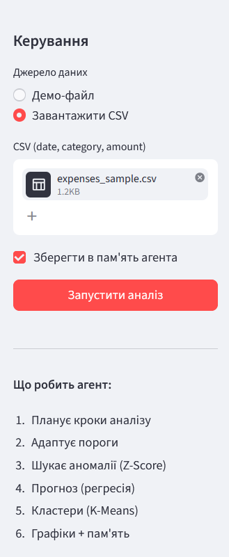
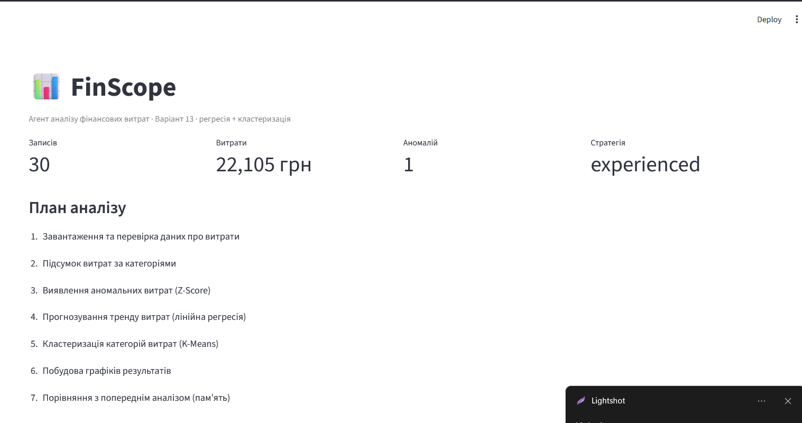
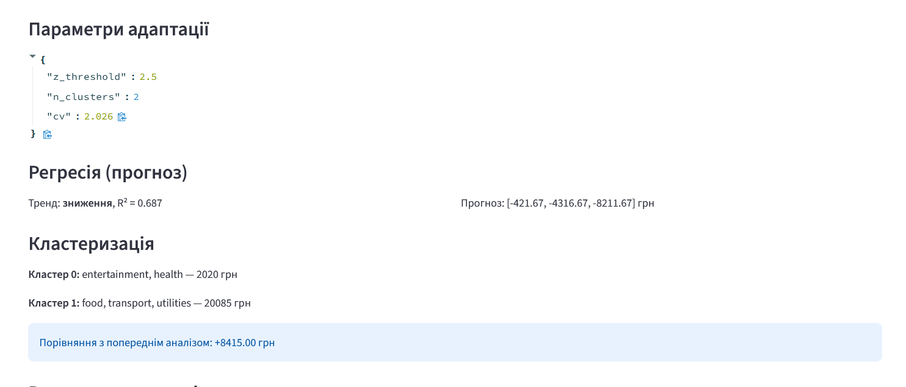
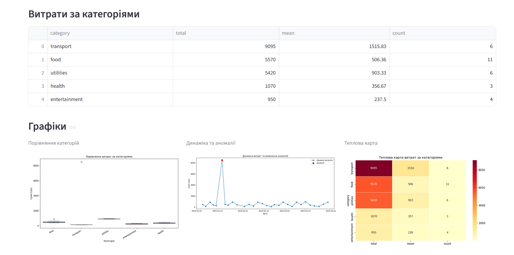
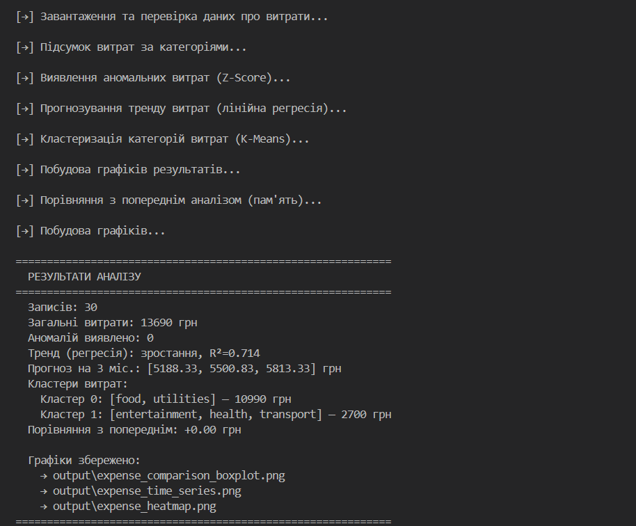

# Практична робота: FinScope — агент аналізу фінансових витрат

**Виконав:** Михайлець Артем, ТВ-33  
**Варіант 13**

---

## Опис завдання

Метою роботи є розробка програмного агента **FinScope**, який обробляє дані про споживання та витрати, застосовує **лінійну регресію** та **кластеризацію K-Means**, а також реалізує чотири властивості дослідницького агента:

| Властивість | Реалізація |
|-------------|------------|
| Пам'ять | збереження сесій у `output/memory.json`, порівняння з попереднім аналізом |
| Інструменти | завантаження CSV, Z-Score, регресія, K-Means, побудова графіків |
| Адаптація | підбір Z-порога, числа кластерів і стратегії за варіативністю даних |
| Планування | формування покрокового плану перед обчисленнями |

Вхідні дані — файл CSV з полями `date`, `category`, `amount`, `description`. Для експерименту використано `expenses_sample.csv` (30 записів).

---

## Логіка обробки даних

1. **Завантаження** — читання CSV, перетворення дат, підрахунок загальної суми витрат.

2. **Планування** — агент формує послідовність кроків: перевірка даних → підсумок по категоріях → аномалії → регресія → кластеризація → графіки; якщо в пам'яті є попередня сесія — додається порівняння.

3. **Адаптація** — за коефіцієнтом варіації (CV) змінюється поріг Z-Score; обирається стратегія (`standard` / `experienced`) залежно від кількості запусків.

4. **Аномалії** — метод Z-Score: транзакції з \|z\| > порога позначаються як нетипові витрати.

5. **Регресія** — лінійна модель по сумарних місячних витратах, оцінка R², напрям тренду, прогноз на 3 місяці.

6. **Кластеризація** — K-Means за ознаками `sum`, `mean`, `count` для кожної категорії.

7. **Візуалізація** — boxplot, часовий ряд з маркуванням аномалій, теплова карта.

---

## Запуск програми

```bash
pip install -r requirements.txt
streamlit run app.py
```

У бічній панелі обирають джерело даних і натискають **Запустити аналіз**. Консольний варіант: `python main.py`.

---

## Робота веб-інтерфейсу

Панель керування дозволяє завантажити CSV, увімкнути збереження в пам'ять агента та запустити повний цикл аналізу.



Після обробки відображаються підсумкові метрики та **план аналізу** (7 кроків, включно з порівнянням із пам'яттю). На тестовому запуску: **30 записів**, сумарні витрати **22 105 грн**, виявлено **1 аномалію**, стратегія адаптації — **experienced**.



Блок адаптації показав параметри: Z-поріг **2.5**, кластерів **2**, CV **2.026**. Регресія дала тренд **зниження** (R² = **0.687**), прогноз на три місяці — **[−421.67; −4316.67; −8211.67] грн** (модель відображає зменшення сумарних місячних витрат на наявній вибірці). K-Means виділив:

- **Кластер 0:** entertainment, health — **2 020 грн**;
- **Кластер 1:** food, transport, utilities — **20 085 грн**.

Порівняння з попередньою сесією в пам'яті: **+8 415 грн**.



---

## Результати аналізу

### Підсумок за категоріями

| Категорія | Сума, грн | Середнє | Кількість |
|-----------|----------:|--------:|----------:|
| transport | 9 095 | 1 515.83 | 6 |
| food | 5 570 | 506.36 | 11 |
| utilities | 5 420 | 903.33 | 6 |
| health | 1 070 | 356.67 | 3 |
| entertainment | 950 | 237.50 | 4 |

Найбільші витрати — **transport** (у т.ч. окремі великі платежі, видно на boxplot). Найбільше операцій — у категорії **food**.

### Візуалізація

На графіках видно розподіл сум по категоріях, динаміку щоденних витрат із **червоною позначкою аномалії** (сплеск наприкінці січня) та теплову карту інтенсивності витрат.



**Boxplot** — найбільший розкид у transport (викиди). **Часовий ряд** — помітний стрибок витрат у січні (аномалія). **Heatmap** — найвищі значення для transport за сумою та середнім чеком.

---

## Лог виконання (консоль)

Той самий агент у консольному режимі (`python main.py`) на демо-наборі:



```
  Записів: 30
  Загальні витрати: 13690 грн
  Аномалій виявлено: 0
  Тренд (регресія): зростання, R²=0.714
  Прогноз на 3 міс.: [5188.33, 5500.83, 5813.33] грн
  Кластер 0: [food, utilities] — 10990 грн
  Кластер 1: [entertainment, health, transport] — 2700 грн
```

Графіки збережено у `output/`: `expense_comparison_boxplot.png`, `expense_time_series.png`, `expense_heatmap.png`.

---

## Структура проєкту

```
sariboga/
├── app.py              # веб-інтерфейс Streamlit
├── main.py             # консоль
├── data/expenses_sample.csv
├── src/                # модулі агента
├── docs/screenshots/   # ілюстрації до звіту
└── output/             # графіки та memory.json
```

---

## Висновки

Реалізовано агента **FinScope**, який відповідає вимогам варіанта 13: обробляє фінансові дані, **планує** кроки аналізу, **адаптує** параметри, використовує **інструменти** (Z-Score, регресія, K-Means) і **зберігає** результати в пам'яті.

На завантаженому наборі витрати склали **22 105 грн**; домінує категорія **transport**. Виявлено **одну аномалію** на часовому ряді. Кластеризація розділила категорії на «дрібні» (розваги, здоров'я) та «основні» (їжа, транспорт, комунальні). Пам'ять агента зафіксувала зміну сумарних витрат на **+8 415 грн** порівняно з попереднім запуском.

Веб-інтерфейс спрощує повторні експерименти без зміни коду; консольний режим підтверджує коректність пайплайну та автоматичне збереження графіків.
